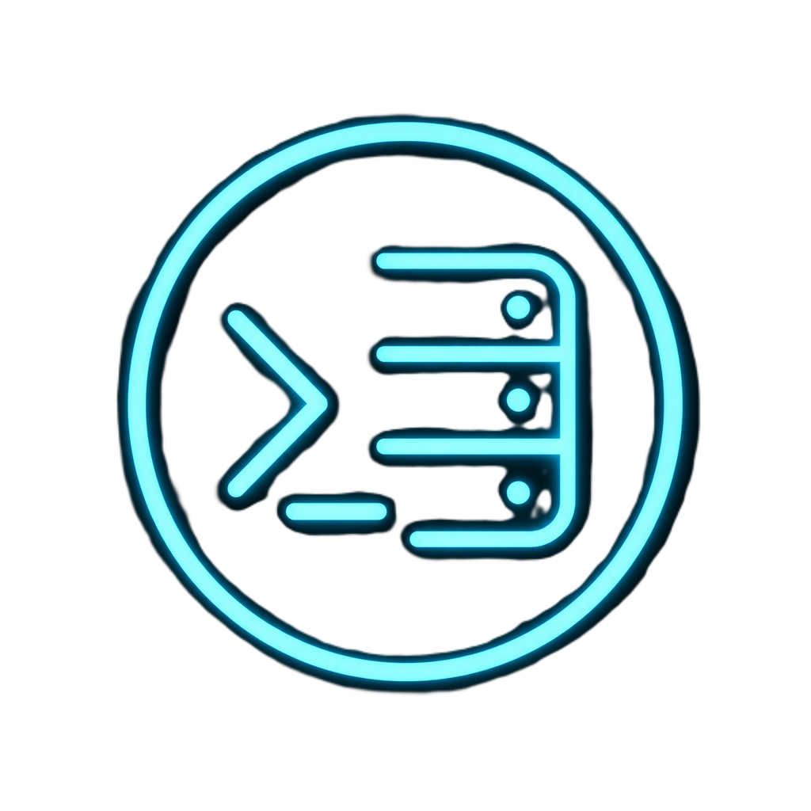

# Glyph Mobile

<div align="center">
  
  <h3>Secure, Glassmorphic SSH & Server Management for Android</h3>
  <p>Live Telemetry • Streaming PTY Terminal • Remote SFTP • Docker Containers • Tunnels • Encrypted Vault</p>

  <p>
    <a href="https://github.com/TheLunatic1/glyph-app/releases/latest"></a>
    
    
  </p>
</div>

---

## Overview

**Glyph Mobile** (`dev.glyph.mobile`) is the high-performance mobile companion to [Glyph Desktop](https://github.com/TheLunatic1/Glyph). Built with React Native and Expo, Glyph Mobile provides system administrators, DevOps engineers, and developers with instant, secure, encrypted mobile access to their SSH servers, real-time server telemetry, interactive PTY terminal tabs, remote SFTP file browsing and code editing, Docker container management, port-forwarding tunnels, and encrypted backup vaults.

---

## ✨ Key Features

### 1. Animated Launch & Glassmorphic UI
* **Opening Splash Animation:** Sleek animated breathing logo, glowing neon backdrop, and smooth launch transitions.
* **Modern Dark Glassmorphic Design:** Deep obsidian dark mode (`#0a0d14`), glowing accent rings, and polished typography.
* **Adaptive App Icon:** Native Android adaptive icon with dynamic background/foreground layers.

### 2. Live Hardware Telemetry & Diagnostic Modals
* **5-Metric Real-Time Dashboard:** SVG circular gauge meters for CPU Usage, Memory Usage, Disk Usage, GPU Detection, and Dual RX/TX Network Bandwidth.
* **Per-Thread CPU Load:** Detailed 1m, 5m, 15m load averages, active/sleeping task counts, per-thread load meters (`cpu0`..`cpuN`), and thermal sensor diagnostic status.
* **Memory & Swap Breakdown:** Total RAM, Used, Buff/Cache, Free RAM allocation with dynamic progress bars, plus live Swap partition metrics.
* **Storage & Partitions:** Live filesystem mount table (`/`, `/boot`, `/run`, `/boot/efi`, etc.) with partition capacity and mount devices.
* **Multi-Vendor GPU Diagnostics:** Automatic probe for NVIDIA (`nvidia-smi`), AMD (`/sys/class/drm` / `rocm-smi`), and Intel GPUs (`intel_gpu_top`) with 1-click driver installation guidance.
* **Network Interfaces:** Multi-interface throughput table (`lo`, `ens3`, `docker0`, `br-*`, `veth*`) showing real-time `↓ Speed`, `↑ Speed`, and `Total RX` transfer volume.

### 3. Interactive Terminal & Mobile Accessory Keyboard
* **ANSI Terminal Emulator:** Full-fidelity streaming PTY terminal over native SSH.
* **Mobile Accessory Keys:** Quick-access accessory bar including `ESC`, `TAB`, `CTRL`, `ALT`, `^C`, `^Z`, `^D`, `|`, `/`, and arrow navigation.
* **Customizable Typography:** In-app terminal font size adjustments with instant persistence.

### 4. Remote SFTP File Manager & In-App Code Editor
* **Directory Browser:** Traverse remote directories with permission badges, file size formatting, and search.
* **Native Downloads:** Download remote files directly to mobile storage with system share sheets.
* **Built-in Code Editor:** Edit remote configuration files and scripts with line numbers, monospaced font, and instant remote save.

### 5. Docker Container Management
* **Real-time Search:** Instant search across container Names, Images, IDs, and States.
* **Daemon Controls:** Start, Stop, Restart, and Remove containers with 1 tap.
* **Streaming Logs Viewer:** Full container log terminal with search filter and clipboard copy.

### 6. Tunnels & Secrets Vault
* **SSH Port Forwarding:** Forward internal remote ports to your local mobile interface with 1-click toggles.
* **Encrypted Secrets Injection:** Store sensitive environment variables and passwords, securely injecting them into terminal sessions without manual typing.

### 7. Security & Desktop Interoperability
* **Biometric Authentication:** Face ID / Touch ID / Fingerprint hardware unlock and optional Master PIN.
* **Desktop Vault Interoperability:** Export and import AES-256-GCM encrypted `.glyph` backup files fully compatible with Desktop Glyph.

---

## 📱 Download & Installation

### Android (Direct APK Sideload)
1. Go to the [Latest Releases](https://github.com/TheLunatic1/glyph-app/releases/latest) page.
2. Download `Glyph-Mobile-Android-v1.0.0.apk`.
3. Tap the downloaded APK to install on your Android device (ensure "Install from Unknown Sources" is enabled in your browser/file manager).

---

## 🍎 iOS & Apple Ecosystem Status

> [!NOTE]
> **iOS Distribution & Building Note:**
> * **Apple Security & Sideloading:** iOS strictly prohibits direct `.apk`-style sideloading on physical devices without paid Apple Developer certificates (`$99/yr`) and provisioning profiles. Unsigned `.app` simulator builds compiled in CI cannot be installed on physical iPhones.
> * **Expo SDK 57 & Xcode 26 / Swift 6.2:** Upstream Expo SDK 57 introduces `expo-modules-jsi`, which currently encounters strict region-based data race checks under Apple's Xcode 26 / Swift 6.2 compiler in CI environments.
> * **Building for iOS:** To build and submit Glyph Mobile for iOS via your Apple Developer Account, use official Expo EAS Cloud Build:
>   ```bash
>   npx eas-cli build --platform ios
>   ```

---

## 🛠️ Development & Local Build

### Prerequisites
* Node.js v18 or newer
* Android Studio & Android SDK
* Java 17 (Temurin recommended)

### Build & Run Locally
```bash
# Clone the repository
git clone https://github.com/TheLunatic1/glyph-app.git
cd glyph-app

# Install dependencies
npm install

# Bundle React Native JavaScript assets
npx expo export:embed --platform android --dev false --entry-file index.js --bundle-output android/app/src/main/assets/index.android.bundle --assets-dest android/app/src/main/res

# Build & install debug APK on connected Android device / emulator
cd android
./gradlew installDebug
```

---

## 👤 Author & Attribution

**Designed & Developed by:**
* **TheLunatic1 (Salman Toha)** — [GitHub Profile](https://github.com/TheLunatic1) • [Glyph Desktop Repository](https://github.com/TheLunatic1/Glyph)

---

## 📄 License

Glyph Mobile is open source software licensed under the [Apache License, Version 2.0](LICENSE).  
See the [NOTICE](NOTICE) file for required attribution terms.
